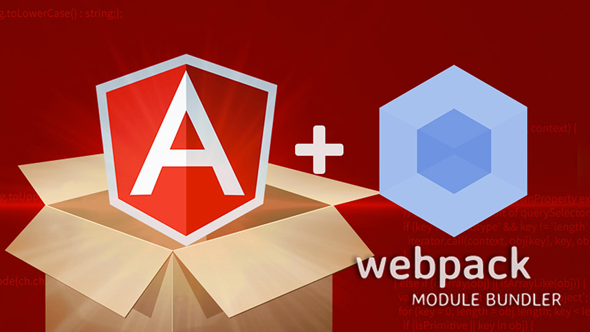

# Angular + Webpack from LoftBlog


## Description
This is an example of using webpack with an Angular project.

A full description and example of work you can see in the video lessons.

[Angular + Webpack](http://youtube.com/)

## Install
```sh
$ git clone https://github.com/Severenit/angular-webpack.git && cd angular-webpack
$ npm install
$ npm start
```

## Tech
You can always get source code for lessons.
You should open the terminal and enter next command:
```sh
$ git checkout -f step-[number-lessons]
```
The list of lessons:
```sh
'Angular + Webpack: Введение': $ git checkout -f step-1
```